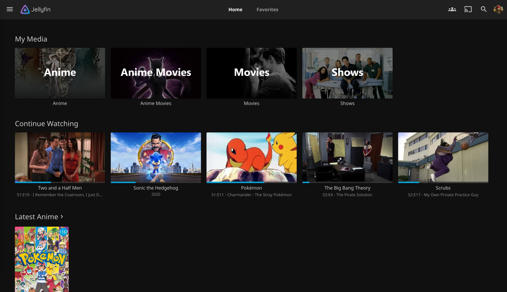
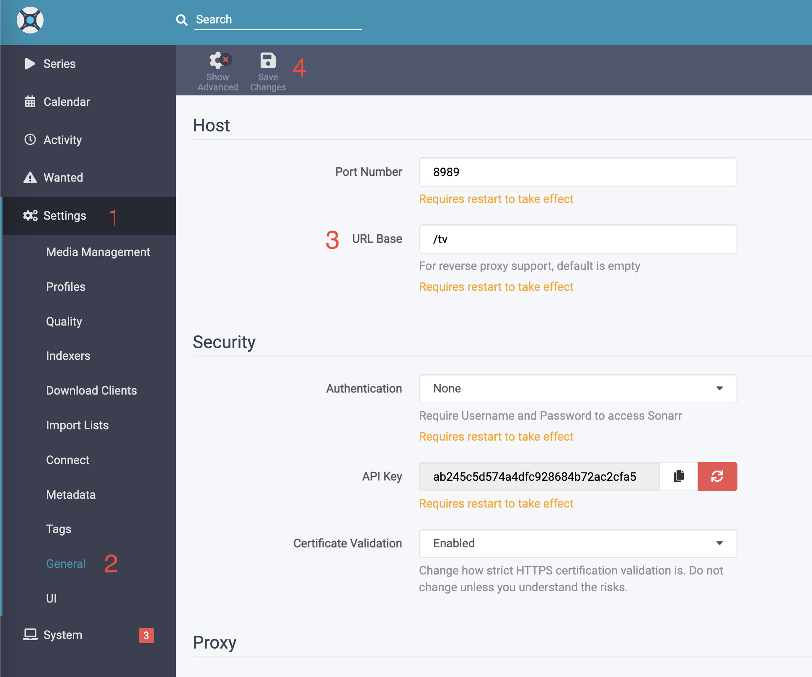
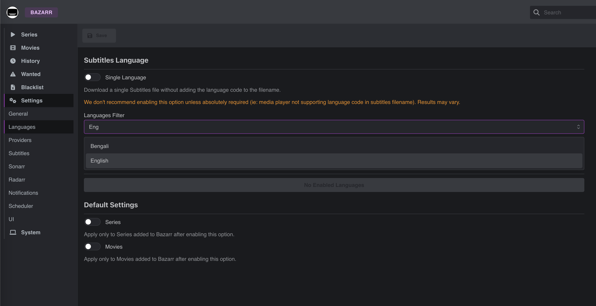

# Home Media Server

### **For Educational Purposes Only**

## Overview

In this project we will set up a home media server using [Jellyfin](https://github.com/jellyfin/jellyfin) as the frontend.
Aside from Jellyfin, the following tools are included:

-   [Sonarr](https://github.com/Sonarr/Sonarr) - TV shows manager and auto-downloader
-   [Radarr](https://github.com/Radarr/Radarr) - Movies manager and auto-downloader
-   [Bazarr](https://github.com/morpheus65535/bazarr) - Subtitles manager and auto-downloader
-   [Prowlarr](https://github.com/Prowlarr/Prowlarr) - Indexers manager, allows to add download sources for Sonarr & Radarr
-   [qBittorrent](https://github.com/qbittorrent/qBittorrent) - A torrent client in order to download media to the server

## Setup guide

1. Clone this repo into a folder that will later contain all of the media (Make sure you have enough free space)
1. Copy the `.env.example` into your own `.env` file. Edit the `.env` file and change the `PUID` and `PGID` values into the results of `id $user` command (Optional: you can also change the paths and timezone here)
1. Open a terminal, change into the cloned directory and run `docker-compose up` (Make sure you have docker installed)
1. Visit http://localhost:8989, go to the 'Settings' tab, 'General' and type `/tv` into 'URL Base'. Then click 'Save Changes', and 'Restart Now'
   
1. Visit http://localhost:7878, go to the 'Settings' tab, 'General' and type `/movies` into 'URL Base'. Then click 'Save Changes', and 'Restart Now'
1. Visit http://localhost:9696, go to the 'Settings' tab, 'General' and type `/sources` into 'URL Base'. Then click 'Save Changes', and 'Restart Now'
1. Visit http://localhost:6767, go to the 'Settings' tab, 'General' and type `subs` into 'URL Base'. Then click 'Save', and restart the docker container for the change to take effect
1. Go to http://localhost/sources/ and click 'Add New Indexer'. Choose from the list and add sources for Sonarr and Radarr to download from
1. Go to http://localhost/tv/, then 'Settings' - 'General' and copy the API Key. Then open http://localhost/sources/, 'Settings' - 'Apps', click the + sign under 'Applications', choose 'Sonarr', fill http://prowlarr:9696/sources/ under 'Prowlarr Server', http://sonarr:8989/tv/ under 'Sonarr Server' and paste the API Key. Test to check everything is OK, and then save.
1. Go to http://localhost/movies/, then 'Settings' - 'General' and copy the API Key. Then open http://localhost/sources/, 'Settings' - 'Apps', click the + sign under 'Applications', choose 'Radarr', fill http://prowlarr:9696/sources/ under 'Prowlarr Server', http://radarr:7878/movies/ under 'Sonarr Server' and paste the API Key. Test to check everything is OK, and then save.
1. Open http://localhost/tv/, go to 'Settings' - 'Download Clients', press the + button and choose 'qBittorrent'. Fill `qBittorrent` under 'Name', `qbittorrent` under 'Host', `admin` under 'Username' and `adminadmin` under 'Password'. Test to check everything is OK, and then save.
1. Still in 'Settings' - 'Download Clients', click the '+' icon under 'Remote Path Mappings', select `qbitorrent`, and fill `/data/downloads/` for both 'Remote Path' and 'Local Path'. Hit save.
1. Open http://localhost/movies/, go to 'Settings' - 'Download Clients', press the + button and choose 'qBittorrent'. Fill `qBittorrent` under 'Name', `qbittorrent` under 'Host', `admin` under 'Username' and `adminadmin` under 'Password'. Test to check everything is OK, and then save.
1. Still in 'Settings' - 'Download Clients', click the '+' icon under 'Remote Path Mappings', select `qbitorrent`, and fill `/data/downloads/` for both 'Remote Path' and 'Local Path'. Hit save.
1. Copy Sonarr's API Key again (http://localhost/tv/, then 'Settings' - 'General' and copy the API Key). Now open http://localhost/subs/, 'Settings' - 'Sonarr', and change the toggle to 'Enabled'. Fill `sonarr` under 'Address', `tv` under 'Base URL' and paste the API key. Click test and you should see a version number to confirm everything is fine. Finally click 'Save'
1. Copy Radarr's API Key again (http://localhost/movies/, then 'Settings' - 'General' and copy the API Key). Now open http://localhost/subs/, 'Settings' - 'Radarr', and change the toggle to 'Enabled'. Fill `radarr` under 'Address', `movies` under 'Base URL' and paste the API key. Click test and you should see a version number to confirm everything is fine. Finally click 'Save'
1. Go to http://localhost/subs/, 'Settings' - 'Languge' and search for the wanted languges for subtitle under 'Languages Filter'
   
   After entering all the languages, click 'Add New Profile'. Under 'Name' fill `subs` and click 'Add Language' and choose the wanted language. If needed add more languages. Then click 'Save' to save the profile.
   Finally, under 'Default Settings' turn on Series and Movies and choose the `subs` profile for both. Finally, click 'Save' on the top bar
1. Go to http://localhost/subs/, 'Settings' - 'Providers' and click the + button to add subtitles providers
1. Go to http://localhost/tv/, 'Settings' - 'Media Management', click 'Add Root Folder' choose the '/data/tv' folder and press OK
1. Go to http://localhost/movies/, 'Settings' - 'Media Management', click 'Add Root Folder' choose the '/data/movies' folder and press OK
1. Go to http://localhost/downloads/ and log-in with the user `admin` & password `adminadmin`. Open the options menu by pressing the gear icon, and in the 'Downloads' tab, enter `/data/downloads` under 'Default Save Path'.
1. (Optional) If you wish to automatically stop torrents from seeding after they are done downloading, on the 'BitTorrent' tab in the options, tick the box that says 'When ratio reaches' and change the value to `0`. Make sure the 'then' part is selected as 'Pause torrent', and hit save.
1. (Optional) If you want to change the credentials from `admin` & `adminadmin`, go to the 'Web UI' tab under options, and configure the new credentials under 'Authentication'. If you wish to avoid needing a password altogether, tick the two boxes 'Bypass authentication for clients on localhost' and 'Bypass authentication for clients in whitelisted IP subnets', and in the textbox enter `0.0.0.0/0`.
1. Everything is set for downloading, finally just go to http://localhost and go through Jellyfin's setup process. (If you see 'Select Server', just click on the server, delete it and reload the page)

That's it, enjoy your new media server setup!
